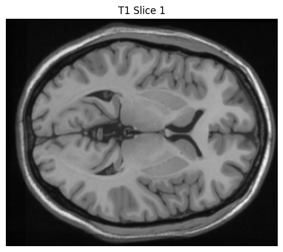
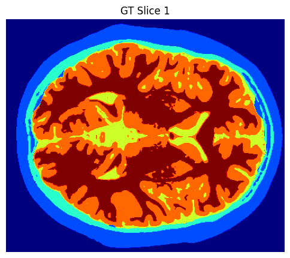
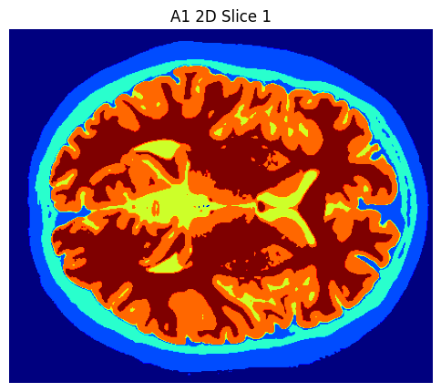
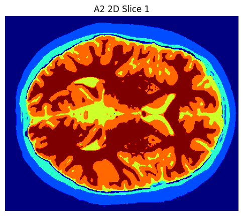
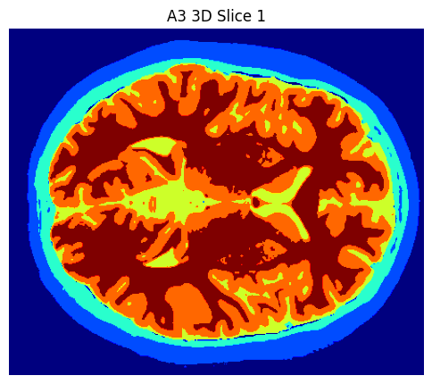
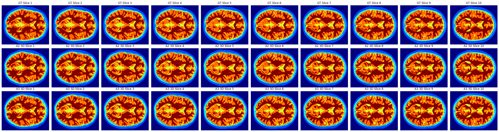

# Brain MRI Segmentation

We study 2D and 3D brain MRI tissue segmentation using traditional computer vision techniques. This project develops and evaluates multiple segmentation approaches on T1-weighted MRI data to segment 6 tissue classes: air, skin/scalp, skull, CSF, gray matter, and white matter.

## Description

This project works with 10 consecutive axial cross-sections of a publicly available MRI of a single human subject. The data consists of:

- **T1-weighted MRI images**: 362×434 pixels per slice, 10 slices at 1mm intervals (10mm total span)
- **Ground truth labels**: Pre-segmented data for comparison and evaluation
- **Tissue classes**:
  - Label 0: Air
  - Label 1: Skin/scalp  
  - Label 2: Skull
  - Label 3: CSF (Cerebrospinal Fluid)
  - Label 4: Gray Matter
  - Label 5: White Matter

 

## What Was Done

### 2D Segmentation Approaches

Three different 2D segmentation approaches were developed and evaluated:

**Approach 1**: Morphological Chan Vese + Otsu Thresholding + K-Means
- Uses Morphological Chan Vese (MCV) for brain extraction
- Multi-Otsu thresholding for non-brain regions (0,1,2)
- K-Means clustering for brain regions (3,4,5)

**Approach 2**: Morphological Geodesic Active Contours + Otsu Thresholding + K-Means  
- Uses Morphological Geodesic Active Contours (MGAC) for brain extraction
- Same thresholding and clustering as Approach 1

**Approach 3**: Morphological Geodesic Active Contours + Otsu Thresholding + Multi-Otsu Thresholding
- Uses MGAC for brain extraction
- Multi-Otsu thresholding for both non-brain and brain regions

### 3D Segmentation Approaches

The best performing 2D approaches were adapted for 3D processing:

**Approach 2 3D**: MGAC + Otsu + K-Means applied to entire 3D volume

**Approach 3 3D**: MGAC + Otsu + Multi-Otsu applied to entire 3D volume

### Key Implementation Details

- **Brain extraction**: Separation of brain and non-brain regions using active contour methods
- **Morphological processing**: Closing and area closing operations to refine masks
- **Region segmentation**: Multi-class segmentation using thresholding and clustering
- **3D adaptation**: Leveraging inter-slice continuity for improved segmentation

## Evaluation

### 2D Results

#### Overall

| Approach | F1-Score | Jaccard Index | Time (sec) |
|----------|----------|---------------|------------|
| A1 (MCV + K-Means) | 0.91 | 0.85 | 56.86 |
| A2 (MGAC + K-Means) | 0.92 | 0.862 | 62.27 |
| A3 (MGAC + Multi-Otsu) | 0.92 | 0.858 | 60.66 |

#### Per-Region

| Region | Tissue | A1 (MCV + K-Means) | A2 (MGAC + K-Means) | A3 (MGAC + Multi-Otsu) |
|--------|--------|-------------------|---------------------|------------------------|
| 0 | Air | F1=0.97, J=0.937 | F1=0.95, J=0.900 | F1=0.95, J=0.899 |
| 1 | Skin/scalp | F1=0.82, J=0.700 | F1=0.87, J=0.774 | F1=0.87, J=0.774 |
| 2 | Skull | F1=0.84, J=0.732 | F1=0.74, J=0.593 | F1=0.74, J=0.593 |
| 3 | CSF | F1=0.64, J=0.471 | F1=0.87, J=0.769 | F1=0.87, J=0.775 |
| 4 | Gray Matter | F1=0.94, J=0.889 | F1=0.94, J=0.895 | F1=0.94, J=0.888 |
| 5 | White Matter | F1=0.98, J=0.957 | F1=0.97, J=0.943 | F1=0.97, J=0.933 |

**2D Visualizations:**

  

### 3D Results

#### Overall

| Approach | F1-Score | Jaccard Index | Time (sec) |
|----------|----------|---------------|------------|
| A2 3D (MGAC + K-Means) | 0.93 | 0.867 | 144.69 |
| A3 3D (MGAC + Multi-Otsu) | 0.93 | 0.865 | 141.11 |

#### Per-Region

| Region | Tissue | A2 3D (MGAC + K-Means) | A3 3D (MGAC + Multi-Otsu) |
|--------|--------|------------------------|----------------------------|
| 0 | Air | F1=0.95, J=0.906 | F1=0.95, J=0.905 |
| 1 | Skin/scalp | F1=0.87, J=0.771 | F1=0.87, J=0.771 |
| 2 | Skull | F1=0.77, J=0.627 | F1=0.77, J=0.627 |
| 3 | CSF | F1=0.87, J=0.774 | F1=0.88, J=0.778 |
| 4 | Gray Matter | F1=0.95, J=0.898 | F1=0.94, J=0.895 |
| 5 | White Matter | F1=0.97, J=0.947 | F1=0.97, J=0.943 |

**3D Visualizations:**

 



### Observation

- **MGAC vs MCV**: Morphological Geodesic Active Contours significantly improved CSF (region 3) segmentation due to better gradient exploitation
- **K-Means vs Multi-Otsu**: K-Means showed slightly better performance on Jaccard Index, while Multi-Otsu was faster
- **2D vs 3D**: 3D approaches achieved better results (0.93 vs 0.92 F1-score) by leveraging inter-slice continuity
- **Performance trade-offs**: 3D processing took ~2.3x longer but provided more robust segmentation

## Conclusions

1. **Best 2D Approach**: Approach 2 (MGAC + K-Means) provided the best balance of accuracy and reliability
2. **3D Advantage**: 3D processing significantly improved segmentation quality, especially for challenging regions
3. **Method Selection**: 
   - For **accuracy**: Approach 2 (2D,3D)
   - For **speed**: Use Multi-Otsu thresholding (2D,3D)
   - For **robustness**: Apply 3D processing when inter-slice alignment is good
4. **Practical Considerations**: 3D approaches are more computationally expensive but provide better results for clinical applications

## Setup

### Prerequisites

- Python 3.9+
- Poetry (recommended) or pip

### Installation

1. **Clone the repository:**
   ```bash
   git clone <repository-url>
   cd .../brain_mri_segmentation
   ```

2. **Install dependencies using Poetry:**
   ```bash
   poetry install
   poetry shell
   ```

3. **Required packages:**
   - numpy
   - matplotlib
   - opencv-python
   - scikit-image
   - scikit-learn
   - scipy

### Usage

1. **For main experiments, evaluations and results:**
   ```bash
   jupyter notebook main.ipynb
   ```

2. **For step-by-step explanations:**
   ```bash
   jupyter notebook step_by_step.ipynb
   ```

3. **Data requirements:**
   - Place `Brain.mat` in the project root directory
   - The file should contain 'T1' (MRI data) and 'label' (ground truth) arrays

### File Structure

- `README.md`: This file
- `main.ipynb`: Complete experiments and evaluation
- `step_by_step.ipynb`: Step-by-step explanations
- `utils.py`: Core segmentation, metrics, and visualization modules
- `Brain.mat`: MRI data and ground truth labels
- `pyproject.toml` and `poetry.lock`: Dependencies
- `demo/`: Visualization outputs and results
